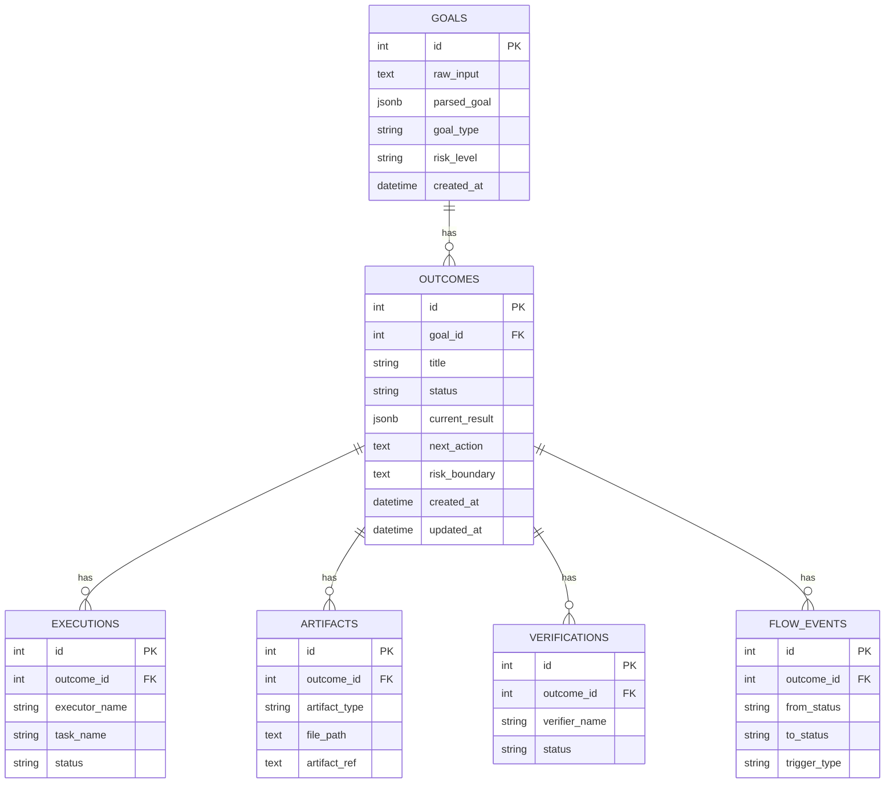

# Entity Relation

```mermaid
erDiagram
    GOALS ||--o{ OUTCOMES : has
    OUTCOMES ||--o{ EXECUTIONS : has
    OUTCOMES ||--o{ ARTIFACTS : has
    OUTCOMES ||--o{ VERIFICATIONS : has
    OUTCOMES ||--o{ FLOW_EVENTS : has

    GOALS {
        int id PK
        text raw_input
        jsonb parsed_goal
        string goal_type
        string risk_level
        datetime created_at
    }

    OUTCOMES {
        int id PK
        int goal_id FK
        string title
        string status
        jsonb current_result
        text next_action
        text risk_boundary
        datetime created_at
        datetime updated_at
    }

    EXECUTIONS {
        int id PK
        int outcome_id FK
        string executor_name
        string task_name
        string status
    }

    ARTIFACTS {
        int id PK
        int outcome_id FK
        string artifact_type
        text file_path
        text artifact_ref
    }

    VERIFICATIONS {
        int id PK
        int outcome_id FK
        string verifier_name
        string status
    }

    FLOW_EVENTS {
        int id PK
        int outcome_id FK
        string from_status
        string to_status
        string trigger_type
    }
```
