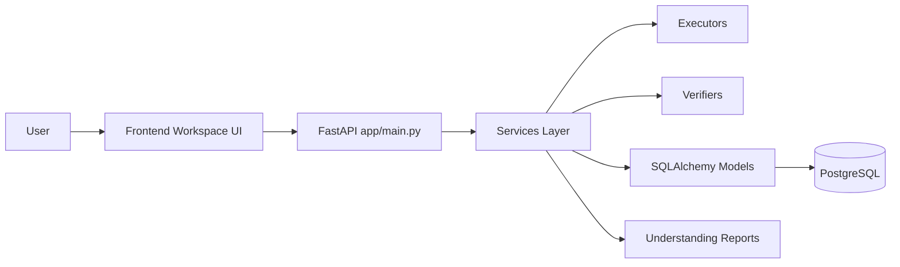
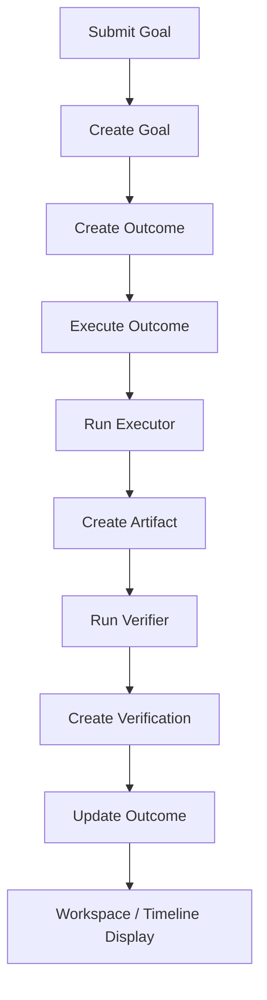

# System Diagram

## 1. 系统模块图

```mermaid
flowchart LR
    User[User]
    FE[Frontend Workspace UI]
    API[FastAPI app/main.py]
    Services[Services Layer]
    Executors[Executors]
    Verifiers[Verifiers]
    Models[SQLAlchemy Models]
    DB[(PostgreSQL)]
    Reports[Understanding Reports]

    User --> FE
    FE --> API
    API --> Services
    Services --> Executors
    Services --> Verifiers
    Services --> Models
    Models --> DB
    Services --> Reports
```

## 2. 主流程图

```mermaid
flowchart TD
    A[Submit Goal] --> B[Create Goal]
    B --> C[Create Outcome]
    C --> D[Execute Outcome]
    D --> E[Run Executor]
    E --> F[Create Artifact]
    F --> G[Run Verifier]
    G --> H[Create Verification]
    H --> I[Update Outcome]
    I --> J[Workspace / Timeline Display]
```
