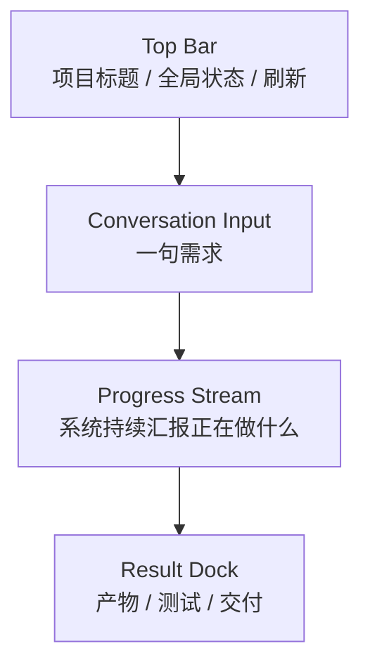

# AutoFabric Codex 风格前端产品方案

## 结论先行

AutoFabric 的默认前端不应该是“项目管理后台”，而应该是“Codex 式任务驾驶舱”。

默认模式下，用户只做两件事：

- 提需求
- 看进度

系统内部仍然保留完整阶段链路：

- `requirement`
- `clarification`
- `prototype`
- `orchestration`
- `execution`
- `testing`
- `delivery`

但这些阶段默认不应成为用户必须逐步点击和操作的前台流程，而应成为系统内部状态机和监控维度。

---

## 一、产品原则

### 1. 默认不让用户做项目经理

用户不应该被要求手动：

- 切阶段
- 点大量“生成”按钮
- 选择 agent
- 选择 skill
- 选择工具链
- 决定前端/后端/数据库如何分工

这些应该由：

- `Codex` 负责分析和编排
- `OpenClaw` 负责运行时调度

### 2. 只有两类情况打断用户

系统只在以下场景主动打断用户：

- 需求歧义到无法继续推进
- 高风险动作需要确认

除此之外，系统应尽量连续推进。

### 3. 用户看到的是任务流，不是系统实现细节

默认前端关注：

- 目标是什么
- 系统目前在做什么
- 是否阻塞
- 已经产出了什么
- 最终如何查看和获取结果

默认前端不关注：

- agent 列表
- skill 组合
- tool adapter 细节
- 数据库表结构
- runtime 内部调度细节

---

## 二、前端双层模式

## 1. Simple Mode

这是默认模式，面向大多数用户。

### 目标

让用户像使用 Codex 一样使用 AutoFabric：

- 输入一个任务
- 看系统自动推进
- 最终查看交付结果

默认情况下：

- 系统自动采用合理的 MVP 假设继续推进
- 只有在歧义过大或高风险动作时才打断用户
- requirement / clarification / prototype / orchestration 等内部阶段默认不要求用户逐步点击

### 页面结构

#### 顶部

- 产品名称
- 当前项目标题
- 当前整体状态
- 一个简洁的“刷新/继续”入口

#### 中心主区

- 会话输入框
- 任务流式过程
- 系统状态更新
- 阻塞/确认提醒

#### 右侧结果区或抽屉

- 当前摘要
- 最新产物
- 测试结果
- 交付包

### 核心卡片

- `Task Input Card`
  - 用户输入一句需求
- `Progress Stream`
  - 系统逐步显示需求理解、原型、执行、测试、交付进度
- `Current Status Card`
  - 当前阶段
  - 当前动作
  - 是否阻塞
- `Outputs Card`
  - 最新产物
  - 可点击预览
- `Delivery Card`
  - 交付摘要
  - 下载入口
  - 运行入口

### 不应默认展示的内容

- 阶段树
- 大量表单
- requirement/prototype/orchestration 的内部 JSON
- agent job 明细
- skill 配置面板
- tool 切换开关

## 2. Operator Mode

这是隐藏模式，面向你自己或高级用户。

### 目标

让操作者能诊断、调优、复盘系统。

### 可以展示的内容

- 阶段状态机
- clarification 明细
- requirement spec / prototype spec
- orchestration plan
- agent jobs
- OpenClaw dispatch/runtime
- artifacts / validation / delivery
- skill bindings
- tool policies

### 典型用途

- 排查卡点
- 调整编排策略
- 检查技能与工具装配
- 追踪 agent 失败原因
- 调优模板和生成质量

---

## 三、Codex 风格信息架构

## 默认 IA

### 1. Top Bar

只保留高价值信息：

- 当前项目名
- 当前总状态
- 最近同步时间
- 全局阻塞提醒

### 2. Conversation Input

只做一件事：

- 提交新需求或追问

建议支持：

- 自然语言需求
- 附件
- 继续追问当前项目

### 3. Progress Stream

这是前端的核心。

应该展示：

- 系统刚理解到了什么
- 系统准备下一步做什么
- 当前正在执行什么
- 哪一步完成了
- 哪一步失败了
- 是否需要人工确认

建议的消息类型：

- `requirement_interpreted`
- `clarification_needed`
- `prototype_ready`
- `orchestration_ready`
- `execution_started`
- `testing_passed`
- `delivery_ready`
- `human_confirmation_needed`
- `risk_detected`

### 4. Result Dock

默认只展示最终可消费结果：

- 最新 README / delivery manifest
- 前端路由或页面预览
- 后端路由或接口骨架
- 测试报告摘要
- 运行入口

---

## 四、前端中系统内部阶段如何映射

虽然不默认暴露完整阶段工作台，但系统内部仍要保留阶段感知。

建议用“叙事化文案”替代“硬阶段面板”：

- `requirement`
  - 正在理解你的需求
- `clarification`
  - 正在补齐关键信息
- `prototype`
  - 正在设计方案和页面结构
- `orchestration`
  - 正在拆解研发计划
- `execution`
  - 正在协同多个 agent 执行
- `testing`
  - 正在验证结果是否可交付
- `delivery`
  - 正在整理交付包

这样用户能理解系统状态，但不会被内部术语绑架。

---

## 五、Simple Mode 的关键交互规则

### 1. 提交后自动推进

用户输入需求后，系统默认执行：

- requirement analyze
- clarification detect
- 若信息足够则直接继续
- 若信息不足则只在必要时追问

### 2. Clarification 要最小化

不要默认把全部澄清问题摊给用户。

建议策略：

- 先自动假设
- 只问关键阻塞问题
- 优先一次问 1-3 个问题

### 3. 输出优先展示结论，不展示中间细节

默认展示：

- “已识别为订单后台项目”
- “已生成 5 个页面”
- “已完成前后端骨架”
- “测试已通过”
- “交付包已生成”

而不是先展示大量结构化 JSON。

### 4. 优先展示结果可用性

每个阶段都要回答一个问题：

- 这一步对用户有什么价值？

例如：

- 原型阶段：可以预览页面结构
- 执行阶段：可以看到正在生成的模块
- 交付阶段：可以下载或运行结果

---

## 六、Operator Mode 的信息架构

建议采用页内“诊断视图”而不是重新做一套站点。

### 入口方式

- 顶部隐藏入口
- 项目设置开关
- URL 参数或环境开关

### 结构

- `Overview`
- `Stages`
- `Specs`
- `Agent Jobs`
- `Runtime`
- `Artifacts`
- `Validation`
- `Delivery`
- `Skills & Tools`

### 建议保留的高级信息

- `requirement_spec`
- `prototype_spec`
- `orchestration_plan`
- `dispatch_id`
- `runtime_status`
- `agent_job_status`
- `skill_bindings`
- `tool_policies`

---

## 七、对当前前端的具体改造建议

当前页面：

- `frontend/src/pages/ProjectWorkbenchManusPage.jsx`

更像“Simple Mode 和 Operator Mode 混在一起”。

### 当前保留价值

- 会话输入框
- 流式消息区
- 文件预览
- 项目切换

### 当前需要隐藏或下沉的内容

- 左侧完整项目树
- 明显的阶段时间线
- 右侧大量 spec 细节默认直出
- 多个手动重建按钮

### 建议改造方向

#### 第一步

先做真正的 `Simple Mode`：

- 中间只保留会话框 + 流程流
- 右侧只保留结果与交付
- 把 spec/orchestration/runtime 细节折叠进“查看详情”

#### 第二步

再把现有右侧深度面板转成 `Operator Mode`

#### 第三步

让 `workspace-summary` 输出同时服务两类视图：

- 简化摘要视图
- 操作员诊断视图

---

## 八、建议的前端输出模型

为了支持 Codex 风格前端，建议后端额外准备一个面向 Simple Mode 的视图模型：

- `conversation_summary`
- `current_action`
- `current_risk`
- `needs_confirmation`
- `progress_events`
- `latest_outputs`
- `delivery_ready`
- `run_entry`

也就是说，前端默认不要直接吃全部底层对象，而是优先吃“面向会话和监控”的读模型。

---

## 九、最终判断

如果产品目标是：

- 用户提需求
- 系统自动研发
- 用户只看进度和结果

那么前端必须转向：

- Codex 风格会话入口
- 过程监控驱动
- 结果交付优先

而不是继续强化：

- 阶段表单驱动
- 人工点击推进
- 工程细节直出

## 十、一句话定义

AutoFabric 的默认前端应该是：

**一个面向最终用户的自动化研发会话驾驶舱。**

内部很复杂，但对用户来说，始终只需两件事：

- 说清楚想做什么
- 看系统如何把它做出来
