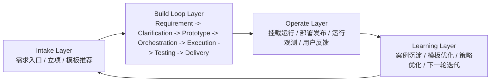

# AutoFabric 自动化研发全寿命周期整合方案

## 结论先行

附件《第二阶段》最适合承担的角色，不是“又一份阶段规划”，而是整个自动化研发系统的正式 **Build Loop 内核**。

也就是说：

- 它不应该和当前项目并列存在
- 它应该成为当前项目的正式主状态机
- 它最适合嵌入“自动化研发全寿命周期”中间最关键的一段

最终形态建议是：

- `Intake Layer`：需求入口与项目创建
- `Build Loop Layer`：需求到交付的 7 阶段研发主循环
- `Operate Layer`：运行、挂载、发布、观测、回流
- `Learning Layer`：案例沉淀、模板优化、策略优化

其中，附件定义的：

- `requirement`
- `clarification`
- `prototype`
- `orchestration`
- `execution`
- `testing`
- `delivery`

应该作为正式 `Build Loop Layer` 保持不变。

---

## 一、目标架构

### 1. 全寿命周期四层模型

### 2. 每一层的职责

#### Intake Layer

负责把模糊输入转成“可进入研发主循环的项目”。

典型职责：

- 接收自然语言需求
- 建立项目
- 初步结构化需求
- 模板推断
- 风险初判
- 判断是否需要进入澄清

#### Build Loop Layer

这是附件的核心内容，也是正式研发主链路。

典型职责：

- 澄清需求
- 生成原型和结构化规格
- 拆解执行计划
- 派发执行
- 产出代码和过程产物
- 做验证和门禁
- 形成交付包

#### Operate Layer

这是当前项目还没有完全补齐的一层。

典型职责：

- 挂载生成的运行时
- 触发部署
- 采集运行状态
- 汇总测试和运行反馈
- 形成真实回流信号

#### Learning Layer

这是系统长期进化能力所在。

典型职责：

- 记录成功/失败案例
- 沉淀模板
- 推荐相似历史方案
- 优化 requirement/prototype/orchestration 的生成质量
- 自动建议下一轮迭代

---

## 二、附件规划应该如何融入

### 1. 附件负责“研发主循环”，不要扩成全系统

附件最强的地方，是把研发主循环拆成了 7 个正式阶段，并且强调了：

- 多轮版本化确认
- 阶段门禁
- 人工闸口
- 正式阶段对象表
- 旧执行链兼容挂接

这些都非常适合成为 `Build Loop Layer` 的正式约束。

因此建议：

- 不修改附件的 7 阶段顺序
- 不把 OpenClaw、Figma、GitHub、CI/CD 当主状态机
- 不再让旧 `goal/outcome` 模型继续承担主语义

### 2. 把附件接到当前项目的正确方式

当前项目已经有可运行底座，应该采用“挂接升级”，不是“推翻重做”。

正确方式：

- 用 `Project` 承载正式主对象
- 用 `project_stage_states` 承载阶段状态
- 用 `requirement_cards / clarification_rounds / prototype_specs / orchestration_plans / delivery_packages` 承载阶段对象
- 用 `stage_transitions / human_approvals / agent_jobs / project_artifact_links` 做治理层
- 把旧 `executions / verifications / artifacts / flow_events` 挂到 `project` 和 `agent_job`

也就是：

- 附件定义流程
- 当前代码提供执行底座
- 两者合并后形成正式系统

---

## 三、当前项目与目标全寿命周期的映射

### 1. 已覆盖较好的环节

#### Intake Layer：基础可用

当前已覆盖：

- 创建项目
- 输入需求
- 初步结构化需求
- 模板推断

对应代码：

- `backend/app/routers/project_router.py`
- `backend/app/routers/project_requirement_router.py`
- `backend/app/routers/project_template_router.py`

判断：

- 已经可以承担生命周期入口
- 但还没有完整的“立项/优先级/历史案例召回”能力

#### Build Loop Layer：主链路已成立

当前已覆盖：

- requirement
- clarification
- prototype
- orchestration
- execution
- testing
- delivery

对应代码：

- `backend/app/routers/project_requirement_spec_router.py`
- `backend/app/routers/project_clarification_router.py`
- `backend/app/routers/project_prototype_spec_router.py`
- `backend/app/routers/project_orchestration_from_requirement_router.py`
- `backend/app/routers/project_dispatch_from_orchestration_router.py`
- `backend/app/routers/project_execution_artifact_router.py`
- `backend/app/routers/project_validation_report_router.py`
- `backend/app/routers/project_delivery_engine_router.py`

判断：

- 这是当前系统最成熟、最接近产品价值的部分
- fresh smoke 已经证明主循环可通

#### 工作台可视化：基础可用

当前已覆盖：

- 项目列表
- 阶段时间线
- requirement/prototype/specs
- artifact files
- delivery 产物预览

对应代码：

- `frontend/src/pages/ProjectWorkbenchManusPage.jsx`
- `backend/app/services/project_workspace_summary_service.py`

判断：

- 已经具备“生命周期可视化控制台”的雏形

### 2. 部分覆盖、但还不完整的环节

#### Operate Layer：只有局部能力

当前已覆盖：

- 生成运行时状态查询
- generated runtime mount
- runtime stage sync

对应代码：

- `backend/app/routers/project_generated_runtime_router.py`
- `backend/app/routers/project_runtime_sync_router.py`
- `backend/app/routers/project_openclaw_runtime_router.py`

判断：

- 当前更像“执行模拟与挂载实验层”
- 还不是真正的“发布、观测、反馈、回流”体系

#### Learning Layer：基本缺失

当前仅有：

- 模板推断
- 一些经验型 fallback

判断：

- 还没有案例库、历史召回、模板评估、下一轮迭代建议的正式能力

### 3. 基本缺失的环节

#### 运行观测

缺少：

- 部署状态
- 运行日志聚合
- 失败告警
- 用户行为反馈
- 运行稳定性指标

#### 反馈回流

缺少：

- 交付后的用户反馈入口
- 缺陷/建议自动回写 requirement
- iteration backlog 自动生成

#### 知识沉淀

缺少：

- 需求案例库
- 原型案例库
- 编排模板库
- 验证失败类型沉淀

---

## 四、如何把附件升级成“全寿命周期主蓝图”

### 1. 前置补一层 Intake

在附件的 7 阶段前面补：

- `lead_intake`
- `project_init`

但这两个不用做成正式大阶段，可作为 requirement 前置动作即可。

建议输出：

- `intake_summary`
- `initial_risk_assessment`
- `template_candidates`
- `project_created`

### 2. 后置补一层 Operate

在 delivery 后面补：

- `runtime_mount`
- `deploy`
- `observe`
- `feedback_collect`

这一层不一定进入主阶段条，但应该成为项目详情中的“交付后生命周期”。

建议输出：

- `deployment_refs`
- `runtime_status`
- `observability_summary`
- `feedback_backlog`

### 3. 再后置补一层 Learning

在 operate 层之后，把结果沉淀为：

- `case_snapshot`
- `template_feedback`
- `quality_scorecard`
- `next_iteration_plan`

这一层的目标不是展示，而是让系统越跑越准。

---

## 五、建议的整合路线

### 阶段 A：把附件彻底定为正式 Build Loop

目标：

- 所有正式阶段都以附件 7 阶段为准
- 所有状态推进只走正式阶段流转
- 所有对象都围绕 project 聚合

这一步已经基本开始，但还需要继续收口。

### 阶段 B：把当前工作台升级成生命周期工作台

目标：

- 不只展示 `Overview / Specs / Files`
- 还要显式展示：
  - Intake 状态
  - Build Loop 状态
  - Operate 状态
  - Learning 状态

建议信息架构：

- 左侧：Project + Lifecycle Navigator
- 中间：当前阶段工作区
- 右侧：Artifacts / Validation / Delivery / Runtime / Feedback

### 阶段 C：补 Operate 层

优先补：

- generated runtime 挂载后的状态回写
- 部署引用
- 运行状态
- 交付后的反馈入口

### 阶段 D：补 Learning 层

优先补：

- 失败案例沉淀
- 模板命中评估
- requirement/prototype/orchestration 的质量反馈
- next step package 自动生成

---

## 六、按“全寿命周期”重排当前优先级

### P0：把 Build Loop 收成正式核心

优先做：

- 正式阶段对象彻底统一
- 阶段门禁服务彻底收口
- 前端工作台继续围绕 7 阶段优化

### P1：把 Delivery 扩成 Delivery + Operate

优先做：

- generated runtime 结果挂接到项目
- delivery 后补 runtime/deploy/observe 结果面板

### P2：把 Requirement 扩成 Intake + Requirement

优先做：docs/LIFECYCLE_INTEGRATION_PLAN.md
/Users/kim/Desktop/AutoFabric_Beginner_Starter/docs/LIFECYCLE_INTEGRATION_PLAN.md

- 风险预判
- 模板候选
- 历史相似需求

### P3：把全链路补成可学习系统

优先做：

- case snapshot
- next iteration suggestion
- template evaluation

---

## 七、最终判断

附件规划和当前项目并不冲突，反而高度匹配。

最正确的整合方式不是“按附件重做一遍”，而是：

- 用附件定义正式研发主循环
- 用当前项目现有闭环做执行底座
- 再向前补 Intake
- 向后补 Operate 与 Learning

这样系统才会从：

- “能从需求跑到交付的自动化 demo”

升级成：

- “覆盖自动化研发全寿命周期的项目工作台 / 研发操作系统”

## 八、当前状态一句话判断

你现在已经拥有了：

- `Build Loop` 的可运行雏形

接下来要做的是：

- 把它变成全寿命周期系统，而不是继续只优化中间那一段。
