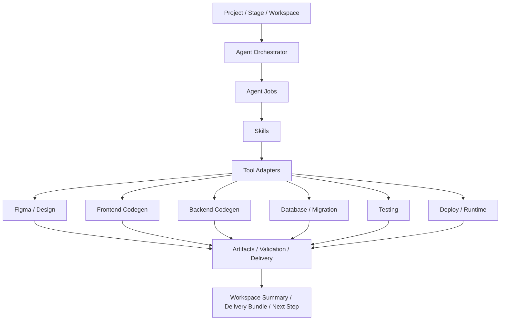

# OpenClaw、Agent、Skills 与工具链整体方案

## 结论先行

为了让 AutoFabric 最终形成一个完整的自动化研发解决方案，角色边界必须先钉死：

- `Project / Stage / Workspace` 是主状态机与控制平面
- `Agent` 是按角色工作的智能体
- `Skill` 是可复用的方法包 / SOP / 能力单元
- `Tool` 是被调用的具体执行器或外部系统
- `OpenClaw` 不是平台大脑，而是执行层的一个重要执行器

最推荐的总方案是：

- **控制平面自研**
- **模型底座优先第三方**
- **Agent 框架自研**
- **Skill 体系自研**
- **OpenClaw 作为浏览器自动化执行器接入**

---

## 一、OpenClaw 应该扮演什么角色

### 正确定位

OpenClaw 最适合扮演：

- 浏览器执行器
- 无 API 系统的桥接器
- 表单填写、网页点击、下载上传、站点操作的自动化手

不适合扮演：

- 平台主状态机
- 项目主对象管理器
- 阶段推进决策器
- 全局任务编排器

### 为什么

从当前代码看，OpenClaw 已经更像执行器而不是大脑：

- `project_dispatch_from_orchestration_service.py` 会先构造 `jobs` 和 `openclaw_payload`
- `project_openclaw_runtime_service.py` 负责 runtime 状态模拟和进度推进
- `openclaw_bridge_service.py` 负责桥接到真实 OpenClaw CLI 或文件请求

这说明现有系统已经天然把 OpenClaw 放在“被调度执行”的位置上。

### 产品级定义

OpenClaw 的正式角色建议定义为：

`Executor Type: browser_automation`

而不是：

`Core Agent Runtime`

---

## 二、Agent 应该第三方还是自研

## 推荐答案

短期：

- **模型能力第三方**
- **Agent 系统自研**

长期：

- 可以逐步把某些高频 Agent 角色做成更强的自研策略层
- 但没必要一开始就自研模型底座

### 为什么不建议一开始全自研

因为你当前真正稀缺的不是“再做一个模型”，而是：

- 项目状态机
- 生命周期治理
- Agent 编排
- Skills 体系
- 工具适配层
- 交付闭环

这些才是 AutoFabric 的核心壁垒。

### 建议的技术归属

#### 第三方负责

- LLM 推理能力
- 通用编码能力
- 视觉理解能力
- 浏览器执行能力

#### 自研负责

- 项目与阶段模型
- Agent 角色系统
- Skill 注册与版本管理
- Tool 权限和调用策略
- 任务拆解和回流逻辑
- 产物、验证、交付的统一闭环

---

## 三、Agent、Skill、Tool 的关系

这是整个系统必须统一的抽象。

### 1. Agent

Agent 是“谁在干活”。

它应该包含：

- 角色
- 目标
- 决策策略
- 可使用的 Skills
- 可调用的 Tools
- 输入输出协议

建议的 Agent 类型：

- requirement_agent
- clarification_agent
- prototype_agent
- planner_agent
- frontend_agent
- backend_agent
- database_agent
- testing_agent
- deploy_agent
- delivery_agent
- reviewer_agent

### 2. Skill

Skill 是“怎么做这类事”。

它应该是：

- 一个方法包
- 一套提示模板
- 一套输入输出 schema
- 一组允许工具
- 一组质量约束

例如：

- `requirement_analysis_skill`
- `clarification_generation_skill`
- `figma_sync_skill`
- `react_page_codegen_skill`
- `fastapi_router_codegen_skill`
- `sql_migration_skill`
- `pytest_generation_skill`
- `playwright_e2e_skill`
- `openclaw_browser_skill`
- `delivery_packaging_skill`

### 3. Tool

Tool 是“用什么执行”。

Tool 应该是：

- CLI
- SDK
- HTTP API
- 浏览器自动化
- 数据库执行器
- CI/CD 平台

例如：

- OpenClaw
- Figma API
- GitHub API
- Docker
- PostgreSQL
- Pytest
- Playwright
- Uvicorn
- Vite

---

## 四、Agent 与 OpenClaw 的 Skills 应该怎么配合

### 1. OpenClaw 不直接等于 Agent

不要把 `openclaw_browser_agent` 理解成完整 Agent。

更合理的设计是：

- Agent 决定做什么
- Skill 决定怎么做
- OpenClaw 执行浏览器动作

也就是说：

- `frontend_agent` 可以调用 `openclaw_browser_skill`
- `testing_agent` 也可以调用 `openclaw_browser_skill`
- 但 OpenClaw 本身不是这两个 Agent 的身份

### 2. 推荐的调用模型

建议把一次任务定义成：

- `Agent Job`
- `required_skills`
- `preferred_executor`

示例：

- 任务：验证订单创建页面是否能正常提交
- Agent：`testing_agent`
- Skills：`playwright_e2e_skill`, `openclaw_browser_skill`
- Executor：
  - 首选 `playwright`
  - 无 API 或页面结构复杂时回退 `openclaw`

### 3. OpenClaw 最适合的 Skill 场景

适合交给 OpenClaw 的 skills：

- 登录站点并获取页面状态
- 跨系统表单填写
- 文件下载与上传
- 无开放 API 的后台操作
- 页面级回归检查
- 演示环境探索

不适合全交给 OpenClaw 的 skills：

- 需求分析
- 任务拆解
- 代码生成主逻辑
- 数据库建模决策
- 发布策略决策

---

## 五、Skills 应该如何配置

建议引入正式 Skill 配置层。

### 1. Skill 元数据

每个 skill 至少包含：

- `skill_key`
- `skill_name`
- `version`
- `description`
- `stage_scope`
- `allowed_tools`
- `input_schema`
- `output_schema`
- `guardrails`
- `retry_policy`

### 2. Skill 绑定方式

建议三层绑定：

- Project 级
- Agent 级
- Job 级

#### Project 级

定义项目的通用能力边界：

- 是否允许 OpenClaw
- 是否允许真实部署
- 是否允许访问生产数据库
- 是否允许外部网络

#### Agent 级

定义某类 Agent 默认可用 skills：

- `frontend_agent` 默认拥有 `react_page_codegen_skill`
- `database_agent` 默认拥有 `sql_migration_skill`
- `testing_agent` 默认拥有 `pytest_generation_skill`

#### Job 级

定义单次任务实际使用的 skill 集：

- 当前任务允许哪些技能
- 是否需要人工确认
- 是否允许高风险执行器

### 3. 配置建议

建议新增以下概念或表：

- `agent_profiles`
- `skill_registry`
- `agent_skill_bindings`
- `tool_adapters`
- `project_tool_policies`
- `agent_job_runs`

---

## 六、前端设计、编码、测试、部署、数据库工具怎么集成成整体方案

最正确的方式不是“工具堆一起”，而是做成统一工具适配层。

## 推荐总架构

### 1. 前端设计

建议接入：

- Figma API 或 Figma MCP

用途：

- 存 prototype 引用
- 同步页面结构
- 回写 `prototype_spec`

归属：

- `prototype_agent`
- `figma_sync_skill`
- `figma_tool_adapter`

### 2. 前端编码

建议接入：

- React/Vite 代码生成
- 设计系统模板
- Lint/Build 工具

归属：

- `frontend_agent`
- `react_page_codegen_skill`
- `frontend_build_tool_adapter`

### 3. 后端编码

建议接入：

- FastAPI/SQLAlchemy 代码模板
- router/service/schema/model 生成器

归属：

- `backend_agent`
- `fastapi_codegen_skill`
- `backend_build_tool_adapter`

### 4. 数据库

建议接入：

- SQL migration generator
- PostgreSQL 执行器
- schema diff 检查

归属：

- `database_agent`
- `sql_migration_skill`
- `database_tool_adapter`

原则：

- 任何真实写库动作都必须可 gated

### 5. 测试

建议分三层：

- Unit/API：Pytest
- UI/E2E：Playwright
- 无 API 场景：OpenClaw Browser

归属：

- `testing_agent`
- `pytest_generation_skill`
- `playwright_e2e_skill`
- `openclaw_browser_skill`

### 6. 部署

建议接入：

- Docker / Compose
- GitHub Actions / GitLab CI
- Preview Environment

归属：

- `deploy_agent`
- `deployment_packaging_skill`
- `cicd_tool_adapter`

### 7. 运行与观测

建议接入：

- runtime mount
- logs
- screenshots
- traces
- delivery refs

归属：

- `operate_agent`
- `runtime_observe_skill`
- `runtime_adapter`

---

## 七、当前代码和目标方案的差距

### 已经有的

- `Project / Stage / Workspace` 主干
- `agent_jobs` 基础模型
- OpenClaw dispatch/runtime 模型
- generated runtime 挂载能力
- codegen / validation / delivery 闭环

### 还缺的

- 正式 Agent Registry
- 正式 Skill Registry
- Tool Adapter Registry
- Project 级 Tool Policy
- Agent Job 的真实执行回执体系
- Deploy / Observe / Feedback 正式层

---

## 八、我建议的最终路线

### 1. 角色边界立刻冻结

从现在开始统一约束：

- OpenClaw = 浏览器执行器
- Agent = 角色智能体
- Skill = 能力包
- Tool = 执行适配器

### 2. Agent 路线采用“第三方模型 + 自研控制平面”

这是当前最合理的技术路线。

### 3. 先做 Registry，再做深接

优先级建议：

1. `agent_registry`
2. `skill_registry`
3. `tool_adapters`
4. `project_tool_policy`
5. `deploy / observe / feedback`

### 4. 再把前端设计、编码、数据库、测试、部署接成统一工具链

关键原则：

- 所有工具都通过 skill 和 adapter 接入
- 不允许工具直接成为主状态机

---

## 九、最终一句话判断

如果你想把这个项目做成一个完整的自动化研发解决方案，那么最关键的不是先接更多工具，而是先确认：

- OpenClaw 是执行器，不是大脑
- Agent 体系要自研控制平面，不要自研模型底座
- Skill 是连接 Agent 与 Tool 的核心中间层
- 所有设计、编码、数据库、测试、部署工具都应该通过统一 adapter 体系纳入 Project 生命周期

这样整个系统才会真正成为：

- 一个有控制平面
- 有执行平面
- 有工具平面
- 有生命周期闭环

的研发操作系统。
