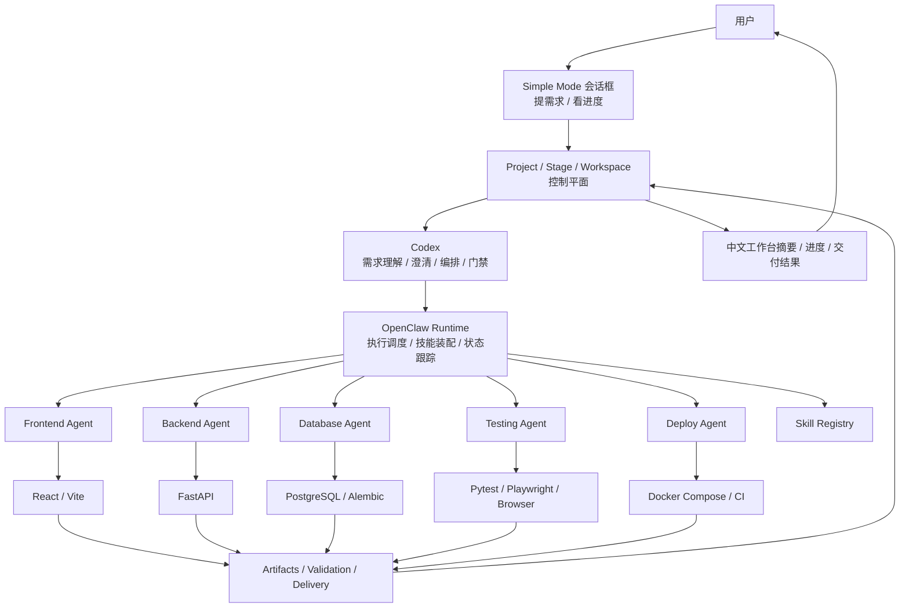

# AutoFabric 平台骨架正式定义

## 目标

把下一阶段最容易摇摆的 6 个核心对象正式冻结下来，作为后续研发、评审、交付和对外讲解的统一口径。

这 6 个对象是：

- `Codex`
- `OpenClaw`
- `Agent`
- `Skill`
- `Tool`
- `Project / Stage / Workspace`

---

## 一、正式定义表

| 对象 | 正式定位 | 主要职责 | 不负责什么 | 关键输入 | 关键输出 |
| --- | --- | --- | --- | --- | --- |
| `Codex` | 平台认知大脑 | 分析需求、生成澄清、确认需求、提出原型方案、生成编排计划、做质量评审与阶段门禁 | 不直接承担长任务运行时调度；不拥有浏览器自动化执行职责 | 用户需求、项目上下文、历史案例、阶段产物 | `requirement_summary`、`clarification_round`、`prototype_strategy`、`orchestration_plan`、`gate_decision` |
| `OpenClaw` | 执行调度中枢 | 接收编排结果、统一装配 `skills`、调度多 `agent`、跟踪任务状态、收集日志和产物、执行浏览器自动化 | 不拥有项目主状态机；不替代 Codex 做需求确认 | `agent_jobs`、`skill_bindings`、`tool_policies`、运行上下文 | `runtime_events`、`job_status`、`artifacts`、`execution_logs`、`retry_results` |
| `Agent` | 专业工种执行单元 | 按角色执行具体工作，如前端、后端、数据库、测试、部署 | 不自己决定项目主流程；不绕开 OpenClaw 私自扩权 | job、skill、允许工具、输入产物 | 代码、配置、测试结果、运行记录、交付产物 |
| `Skill` | 可版本化的方法包 | 约束某类任务的输入输出 schema、步骤模板、允许工具、质量标准和 guardrails | 不直接承载项目状态；不直接替代 agent 执行 | skill 定义、版本、策略 | 标准执行方式、工具装配规则、质量约束 |
| `Tool` | 具体执行器与外部系统接口 | 提供设计、编码、数据库、测试、部署等能力 | 不负责判断项目阶段和产品语义 | skill 或 agent 的调用请求 | 原始结果、日志、文件、构建物、部署结果 |
| `Project / Stage / Workspace` | 平台控制平面 | 保存正式项目对象、生命周期阶段、聚合工作台视图、审计记录、人工确认节点 | 不直接替代 Codex 做推理；不直接替代 OpenClaw 做调度 | 用户需求、阶段产物、运行结果、人工确认 | 项目状态、阶段状态、工作台摘要、交付视图 |

---

## 二、必须冻结的边界

### 1. `Codex`

`Codex` 负责“想清楚”。

- 判断用户真正要什么
- 决定还需要问什么
- 决定系统下一步做什么
- 给出原型、编排、评审和门禁判断

### 2. `OpenClaw`

`OpenClaw` 负责“组织起来干完”。

- 统一调度多 agent
- 统一管理 skills
- 统一跟踪执行状态
- 统一收集运行结果

### 3. `Agent`

`Agent` 负责“按工种完成任务”。

- `frontend_agent`
- `backend_agent`
- `database_agent`
- `testing_agent`
- `deploy_agent`

### 4. `Skill`

`Skill` 负责“把做事方式标准化”。

- 输入输出 schema
- 标准步骤模板
- 允许的工具列表
- 风险边界
- 质量要求

### 5. `Tool`

`Tool` 负责“把事情真正执行出来”。

建议冻结的第一批工具：

- 原型与设计：`Figma`
- 前端：`React + Vite`
- 后端：`FastAPI`
- 数据库：`PostgreSQL + SQLAlchemy + Alembic`
- 测试：`Pytest + Playwright`
- 浏览器自动化：`OpenClaw Browser`
- 部署：`Docker Compose`
- CI：`GitHub Actions`

### 6. `Project / Stage / Workspace`

这是平台真正的控制平面。

- `Project`：正式业务主对象
- `Stage`：正式生命周期状态
- `Workspace`：面向前端的聚合工作台视图

这里必须保留在 AutoFabric 内部，不交给 OpenClaw。

---

## 三、正式交互模型

---

## 四、下一阶段的研发主线如何一步步确认

### Step 1：确认平台骨架

确认以下口径不再变化：

- `Codex` 是认知大脑
- `OpenClaw` 是执行调度中枢
- `Agent` 是专业工种
- `Skill` 由 OpenClaw 统一管理
- `Tool` 通过 adapter 接入
- `Project / Stage / Workspace` 是控制平面

### Step 2：确认默认产品形态

确认默认前端只保留：

- 提需求
- 看进度
- 看结果

并且默认展示语言为中文。

### Step 3：确认正式执行链

确认系统主链固定为：

`Codex -> OpenClaw -> Agent -> Skill -> Tool -> Artifact / Validation / Delivery`

### Step 4：确认标准交付方案

默认交付统一为：

1. `源码包`
2. `Docker Compose 交付包`
3. `预览环境 / 可挂载运行时`

`虚拟机镜像` 仅作为特殊场景交付选项。

### Step 5：确认平台闭环

确认交付后继续进入：

- `deploy`
- `observe`
- `feedback`
- `learning`

这样系统才从“自动化研发演示”升级成“可推广的平台”。

---

## 五、前端与展示语言原则

默认用户界面应遵循以下规则：

- 所有对用户可见的主要展示文案以中文为主
- 用户默认不需要理解内部阶段术语和工具链细节
- 日志、代码、文件名、第三方工具原始字段允许保留英文
- 高级诊断信息放入 `Operator Mode`

默认用户只做两件事：

1. 提需求
2. 看进度

---

## 六、形成可推广平台的标志

当以下条件同时满足时，才算形成可推广的平台骨架：

- 主链路稳定可复跑
- 角色边界清晰且不混乱
- 中文默认前端已完成收口
- OpenClaw 已能统一管理 skills 和多 agent 执行
- 工具链已形成标准工程交付方案
- 系统具备运行、反馈、学习能力

## 结论

下一阶段的核心不是继续堆功能，而是把“能跑通的自动化研发链路”正式收敛成一套稳定的平台骨架：

**Codex 负责理解与编排，OpenClaw 负责统一调度执行，Project 生命周期负责治理与交付，前端默认只让用户提需求、看进度，并以中文为主要展示语言。**
